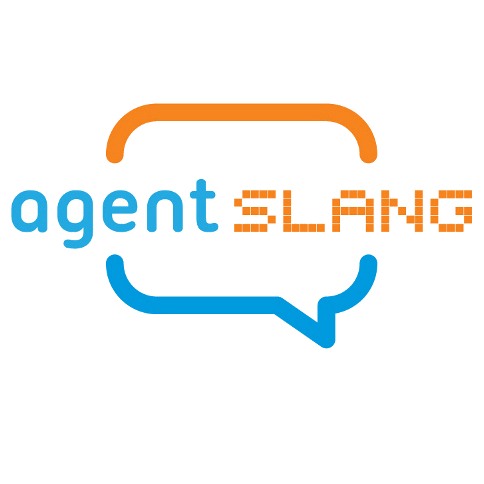

  

AgentSlang is a collection of components, created on top of the MyBlock middleware platform, which enables to build rich, distributed and fast Interactive Systems. MyBlock ensures the component-to-component communication, dealing with data transmission in an efficient way. It adds a transparent layer of communication so that AgentSlang components do not have to deal with all these concepts.

The choice of a certain Message Queue protocol implementation has been done on licence availability, popularity and performance. In particular, we benchmarked ZeroMQ over ActiveMQ, to confirm that ZeroMQ (our choice) is a faster and reliable candidate, which supports multiple connection types, different communication patterns, the possibility to send binary data and the absence of a broker component, which slows down a distributed pipeline architecture.

The [design page](pages/design.md) shows more details about the design deccisions. If you want to try this please head out to our [install guide](pages/install.md) or [API documentation](pages/api/index.md) for more details about the available components.

The [demos page](pages/demo.md) show current implementations and projects using the AgentSlang system.

Contact details and contributer information is available on the [team page](pages/team.md).
